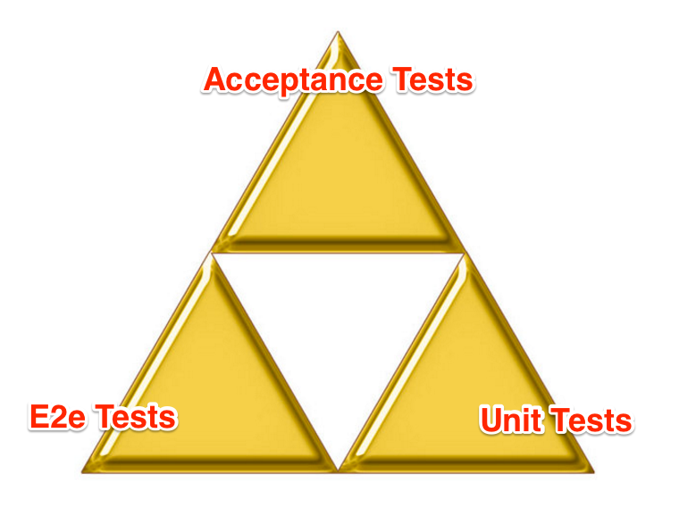
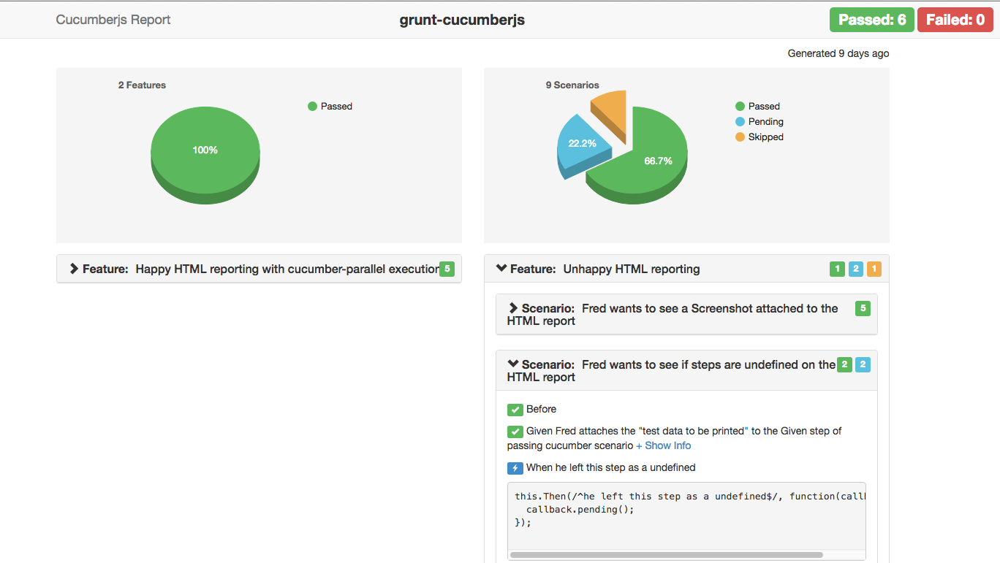
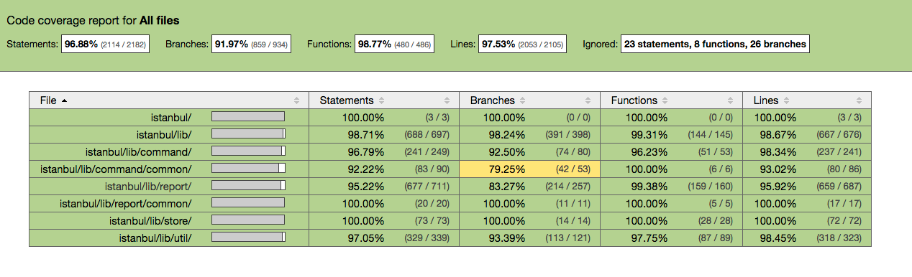
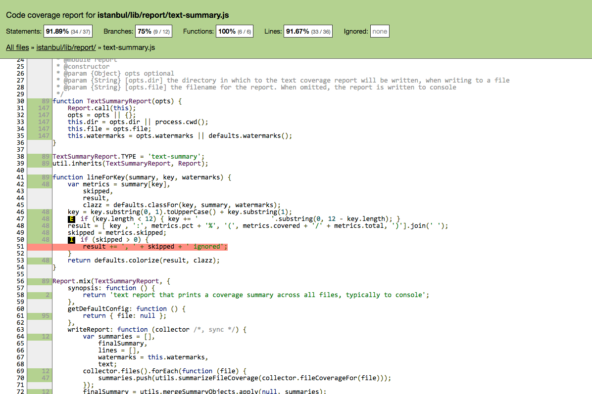

#  ~ The Triplex Testing Guidebook ~ 

A three-pronged approach to building great software with automated tests. 

---

Table of Contents
  - [Part 1: Intro to The Testing Triplex](#Intro to The Testing Triplex)
    - [History of the Testing Triplex](#history)
    - [Purpose of The Testing Triplex](#Purpose of The Testing Triplex)
    - [It's Not Specific To Angular](#It's Not Specific To Angular)
    - [This is a Guide for Developing Software](#This is a Guide)
  - [Part 2: The Three Types of Automated Tests](#The Three Types of Automated Tests)
    - [Overview of the Three Parts](#Overview of the Three Parts)
    - [The Triplex Diagram](#The Triplex Diagram)
    - [Acceptance Tests](#Acceptance Tests)
    - [E2e Tests](#E2e Tests)
    - [Unit Tests](#Unit Tests)
  - [Part 3: The Testing Triplex in Practice](#The Triplex in Practice)
    - [Where Do I Put My Files?](#Where Do I Put My Files)
    - [The Gherkin Comes First](#The Gherkin Comes First)
    - [Executing The Gherkin Scripts](#Executing The Gherkin Scripts)
    - [Executing the Acceptance Tests](#Executing the Acceptance Tests)
    - [Implementing Step Definitions with Protractor](#Implementing Step Definitions with Protractor)
    - [Implementing E2e Tests in a Separate Protractor Config file](#Implementing E2e Tests in a Separate Protractor Conf.js file)
    - [Write Unit Tests and Code TDD Style](#Write Unit Tests and Code TDD Style)
    - [Notes on Deployment](#Deployment)
    - [Testing On Multiple Browsers](#Testing On Multiple Browsers)
    - [Everyone Reads the Gherkin, Dev's Change the Gherkin](#Everyone Reads, Devs Change)
    - [No Manual Testers](#No Manual Testers)
    - [The BAU Handoff](#The BAU Handoff)
  - [Part 4: Additional Benefits of Triplex Development](#Additional Benefits of Triplex Development)
    - [Better Team Communication and Ubiquitous Language](#Better Team Communication and Ubiquitous Language)
    - [The Requirements and Code Are Always In Sync](#The Requirements and Code Are Always In Sync)
    - [No Manual Testing](#No Manual Testing)
    - [Living Documentation](#Living Documentation)
  - [Part 5: Reporting](#Reporting)
    - [Generating Reports From the Codebase](#Generating Reports From the Codebase)
    - [Meetings with "The Boss"](#Meetings with The Boss)
    - [Sample Reports](#Sample Reports)
  - [Part 6: Official Triplex Projects](#Official Triplex Projects)
    - [NG-NJ](#NG-NJ)
  - [Part 7: Closing Thoughts](#Closing Thoguhts)
    - [The Mythical "Fourth Plex"](#The Mythical Fourth Plex)
    - [Laid Back Perfectionism](#Laid Back Perfectionism)
    - [Why "Test Your Own Code" Is a Terrible Policy](#Why Test Your Own Code Is a Terrible Policy)
    - [Triplex Testing and the V-Model](#Triplex Testing and the V-Model)
    - [Effective Collaboration and Mob Programming](#Effective Collaboration and Mob Programming)
    - [Triplex Tester Certification](#Triplex Tester Certification)
    - [Exploratory Testing](#Exploratory Testing)
    - [Triplex Testing Community Groups](#Triplex Testing Community Groups)
  - [Part 8: Frequently Asked Questions](#FAQ)
    - [Q1. Why is it wrong to treat low level step definitions like unit tests?](#Q1)
    - [Q2. Do I *need* to use acceptance tests?](#Q2)
    - [Q3. Do I *need* to use unit tests?](#Q3)
    - [Q4. Do I *need* to use e2e tests?](#Q4)
    - [Q5. When should I *NOT* use the Testing Triplex?](#Q5)
    - [Q6. Most Cucumber / BDD examples have a root level "features" folder. Why don't you follow this convention?](#Q6)
    - [Q7. My boss says we don't have enough time for testing. What should I do?](#Q7)
    - [Q8. Q8. Can't we just manually test everything?](#Q8)
    - [Q9. Will the theory of Triplex Testing work for [insert favorite platform here]?](#Q9)


<div name="Intro to The Testing Triplex"></div>
## Part 1: Intro to The Testing Triplex
---
<div name="history"></div>
### History of The Testing Triplex
The Testing Triplex phrase was coined by Jim Lynch. While working as an angularJS developer he was doing standard unit testing along with some Protractor tests. Jim then read a book on BDD (Behavior Driven Development) and fell in love with the gherkin syntax and the way is was connected to step definitions. It was unclear how exactly to fit this into an Angular, SPA, or general JavaScript project in a way that gelled nicely with the other types of automated tests. After intensely studying these types of testing and using the, on various real-world projects he finally [built of time] found a way of developing software that works well and incorporated the three types of automated tests. This document attempts to formalize this philosphy that is now known as The Testing Triplex.

<div name="Purpose of The Testing Triplex"></div>
### Purpose of The Testing Triplex

The testing triplex is meant to prescribe a way for writing three types of automated tests: acceptance tests, e2e tests, and unit tests, but even more than that it builds on the test-first theories of TDD. Thus, the testing triplex becomes a tao, or way of developing software where the result is truly transparent, agile, and well-done. This guide provides a set of instructions for developing with The Triplex Testing mindset, but it is up to you to find the tao on your own.

<div name="It's Not SpecificTo Angular"></div>
### It's Not Specific To Angular
It should be noted that the Testing Triplex is not something that is dependant on the Angular library. It can be applied to really any project made from html, css, and javascript which can be tested with Protractor and JavaScript unit testing framework like Jasmine or Chai-Mocha. It can even be applied to other front-end platforms like .NET, Ios, Android, Java, Ruby, C++, etc. although you will need different tooling for that platform than what is discussed here. 

<div name="This is a Guide"></div>
### This is a Guide For Developing Great Software
This document is meant to be a guide for implementing triplex testing into your own project. Rather than be taken as gospel, the ideas expressed here are meant to convince you of the benefits of implementing these three types of automated testing. The prescribes methodoligies here have been tried a tested, but you are free to change things in your own case if you find it necessary to do so. Note that this is not a guide for writing or running any of the three test types (although you may find the sample config files and shell commands useful). Rather, this is a more meta guide on building great software by leveraging automated testing. 
 
---
 <div name="The Three Types of Automated Tests"></div>
## Part 2: The Three Types of Automated Tests


 <div name="Overview of the Three Parts"></div>
### Overview of the Three Parts
If you looked up the word *triplex* in the dictionary you would get such definitions like, "a dwelling composed of three units" or, "having three parts". Triplex Testing gets it name from it's three independent parts, and understanding each of the three parts is critical to doing Triplex Testing correctly. Later in this chapter we'll get more technical and later we'll talk about different tooling for various tests, but here I want to describe each of the three parts in simple, platform-independent terms.

- Tests that check the **requirements, behavior, specifications** of the project. 


- Tests that check the **internal application logic and algorithms** of the project  - 


- Tests that check the **interactions and connections between components or systems**. 


<div name="The Triplex Diagram"></div>
### The Triplex Diagram



*credit: the triforce image is a copyrighted symbol of Nintendo Corporation and was popularized by the video games franchise "The Legend of Zelda".*

Here we use it the triplex diagram represent the three types of automated tests: 

- Acceptance Tests
- E2e Tests
- Unit Tests

<div name="Acceptance Tests"></div>
### Acceptance Tests
 

Acceptance tests, at the very top of the triplex diagram, should be the starting point at the beginning of any automated testing effort. Because it necessarily forces you to think about the application in high level terms about what it is actually doing, it is a perfect way to **figure out what you want to build** while at the same time *effectively communicating those ideas to the developers, business analysts, and other stakeholders*. 

The gherkin feature files are normally referred to as high level acceptance tests. Using the Given-When-Then-And-But syntax, these high level acceptance tests are then mapped to low-level acceptance tests, written in your projects main programming language (in this case JavaScript). 

Acceptance tests don't end with the feature files in Gherkin syntax. Acceptance tests refer to both the feature files and the step definition files. These should be basically selenium web-tests. Some people may be inclined to treat the low level step definition methods as if they were unit tests. **Don't fall into this trap.** 


These are tests that come from the theory of behavior-driven development. They consist of two types of files– feature files and step definition files. At ng-nj, we like to use Cucumber.js for this, and we recommend running it through Protractor by selecting the cucumber framework in your protractor.conf.js file. Although these tests are "web tests" and focus on testing the ui in a selenium-like fashion, these tests should use mock data and should NOT be hitting external endpoints. Since these are high level feature specifications tied to low-level step defintions, these tests will cover all of the acceptance criteria for the project.  

<div name="E2e Tests"></div>
### E2e Tests
 

These are tests that do hit external endpoints. Normally, we set these up in a separate protractor.conf.js file. Althoguh we use protractor for these tests, they are not as concerned with simulating an actual user interacting with the application. These tests are solely with interacting with external resources to ensure that they work as expected. These tests could do such things like check to see if files exist in a remote location, check that any random transaction works for your current database instance, check that saving and retrieving data from the file system works, etc. this is also the place where you might put exploratory tests (tests that try to expose bugs) or other types of stress tests.

<div name="Unit Tests"></div>
### Unit Tests
 

Ahh, the unit tests. Incorporating heavy Protractor usage for E2e and acceptance tests should not steal any thunder at all from the classic unit tests. Indeed, doing all that preparatory Protractor work and writing out the features in gherkin, makes it much easier to start unit testing because you have a clear direction of where you want to be. Unit tests are concerned with checking individual functions. These normally return a coverage report, and as always we aim for 100% coverage by unit tests. 


--- 
<div name="The Triplex in Practice"></div>
## Part 3: The Triplex in Practice
This section provides some advice for using the Triplex in Practice.

<div name="Where Do I Put My Files"></div>
### Where Do I Put My Files? 
Most experienced SPA developers agree that at a high level a feature-based directory structure scales best and that parallel directory structures should be avoided. Tests that can be directly attributedto certain classes or features should be near them. We recommend putting a *feature* directory in the root directory of that particular feature. Then put the .feature file and step definitions (optionally in a step_definitions subfolder) inside of the new directory. For units tests I like to keep the .spec.js test file directly next to the correponsing .js file. Since our acceptance tests are the selenium / Protractor tests heavily tied to the features, the E2e tests can be more general. For example, an e2e test could just check that a database endpoint returns *something.* This has nothing to do with any particular feature, and for this reason it's customary to have an e2e folder on the same level as the src folder which stores all of the e2e tests. In JavaScript a good build script can sort out the feature and step definition files so it's fine to put your acceptance tests and unit tests right in the src folder with the relevant files for that particular feature. As a final note on this topic I'll mention that if you do decide to have *parallel directory trees* and your apps grows large enough you (or your developers) are going to be scrolling like crazy, losing track of files, and possibly considering giving up on testing. Make good choices about your directory structure.                                 

<div name="The Gherkin Comes First"></div>
### Gherkin Comes First
Is a piece of software really anything more than the features it provides? What better way to begin describing a project than by describing gherkin features and scenarios? And if we are discussing them, we might as well write them into .feature files because then they can be stored in version control, referred back to later, and even executed by command shell. Here's an example of some Gherkin **code**:
```
Feature: Display Weather
    In order to see the current temperature on the screen
    As a user of the app
    I want to see the weather on the screen wehn the page loads.

    Scenario: Page first loads
      Given I navigate to this page
      When the page first loads
      Then I should see the current temperature displayed.
```

Looks like plan English right? That's the beauty of it. If you start thinking about the vision you have of your application in terms of features and scenarios it help in a number of ways:

- It fleshes out many of situations, and a lot of unknowns and what would be questions down the road are hammered out early. 
- Because it's written down it's not just in one person's head or spoken aloud in a meeting and forgotten. This also makes it clear when two people have different interpretations of something (usually) and helps to clear up understanding.
- Because it's Gherkin syntax, these scenarios can be *executed* to ensure they always pass for the latest build.
- It gives some type of benchmark for progress on the project, scope and timeline estimation, and exposes potentially difficult issues to solve early.


<div name="Executing The Gherkin Scripts"></div>
### Executing The Gherkin Scripts
We recommend running your gherkin JavaScript files through Protractor by setting the framework to "".
Here is an example of a protractor config file that runs the cucumberjs framework:

*acceptance-tests.config.js*
```
'use strict';

exports.config = {
  // The address of a running selenium server.
  // seleniumAddress: 'http://localhost:4444/wd/hub',
  //seleniumServerJar: deprecated, this should be set on node_modules/protractor/config.json

  framework: 'custom',
  frameworkPath: require.resolve('protractor-cucumber-framework'),

  capabilities: {
    'browserName': 'chrome'
  },
  
  resultJsonOutputFile: 'cucumber-report/report-output.txt',

  baseUrl: 'http://localhost:3000',

  specs: [paths.features + 'src/**/*.feature'],

  cucumberOpts: {
    format: 'pretty',
    require: 'src/**/*.step.js'
  },

  jasmineNodeOpts: {
    defaultTimeoutInterval: 25000
    //   showColors: true,
  }

};

```

<div name="Executing the Acceptance Tests"></div>
### Executing the Acceptance Tests
The ability to run the acceptance tests through the command line is what sets apart Gherkin from just typing out requirements and user stories into Jira or Trello. Although vitally important to the triplex testing process, executing your feature files is actually not that hard. 

Add this file to your project and then install the necessary modules

` npm install protractor-cucumber-framework --save-dev`

Now you should be able to run gherkin tests like this:
`./node_modules/protractor/bin/protractor acceptance-tests.config.js`

<div name="Implementing Step Definitions with Protractor"></div>
### Implementing Step Definitions with Protractor Selenium Tests
If you are using the protractor config file above then you might notice that for the step definition files it's only looking for .steps.js files. This means we can put them anywhere in our project, and we don't need any *step_definitions* folders (but if you think it makes things more readable go ahead and use them). The scenarios will almost always be from a user's point of view, and so it naturally follows to automate the tests from the user's point of view. This is why we write low level step definitions with protractor api. Your scenarios should just describe things that should happen, and in the protractor tests you can *expect* those things to happen after clicking (or interacting with in another way) some element on the page. Also, notice that these tests are still using the underlying functions of the application and so the protractor tests are indirectly testing individual functions of the application. However, because this protractor tests check the application in a *black box* fashion, when errors fail it's tough to find the root cause of issues from these tests alone. 


<div name="Implementing E2e Tests in a Separate Protractor Conf.js file"></div>
### Implementing E2e Tests in a Separate Protractor Conf.js file.
This section is purposely put before "write the production code" because it should come first. Unless you have a really hazy idea of what you're building (red flag), you should at least know what external resources you are connecing to. Even if the backend has not been finished yet, you can still set up the e2e test firing away at it from day one, and simply let it fail. Comment it out if it bothers you, and then as soon as that endpoint is ready add that e2e test back in. Some developers get flustered and afraid when they think about writing e2e tests, but actually these are the easiest of all.

Here is a sample protractor file for running e2e tests:

*e2e-tests.config.js*
```
'use strict';

exports.config = {
  //seleniumAddress: 'http://localhost:4444/wd/hub',
  //seleniumServerJar: deprecated, this should be set on node_modules/protractor/config.json

  capabilities: {
    'browserName': 'chrome'
  },
  
  resultJsonOutputFile: 'e2e/e2e-report.json',

  baseUrl: 'http://localhost:3000',

  specs: ['src/**/*.js'],

  jasmineNodeOpts: {
   showColors: false,
    defaultTimeoutInterval: 30000
  }
};
```

You can run this with this command:
`./node_modules/protractor/bin/protractor e2e-tests.config.js`

<div name="Write Unit Tests and Code TDD Style"></div>
### Write Unit Tests and Code TDD Style 
Write the actually code in the usual TDD style with unit tests is code while using the protractor tests and gherkin feature files as a guide for what the code should do. For modern JavaScript development, karma seems to have gained a stronghold as the most popular unit test runner. Many scaffolded pojects have support for unit testing out of the box, but they are really just providing you with a karma.conf.js file. You could make this file yourself or change your current one as you like. 

Here is an example of a karma configuration file:

*unit-tests.config.js*
```
module.exports = function(config) {

  var configuration = {
    files: listFiles(),

    singleRun: true,

    autoWatch: false,

    ngHtml2JsPreprocessor: {
      stripPrefix: conf.paths.src + '/',
      moduleName: 'icpComp'
    },

    logLevel: 'WARN',

    frameworks: ['phantomjs-shim', 'jasmine', 'angular-filesort'],

    angularFilesort: {
      whitelist: [path.join(conf.paths.src, '/**/!(*.html|*.spec|*.mock).js')]
    },

    browsers : ['PhantomJS'],

    plugins : [
      'karma-phantomjs-launcher',
      'karma-angular-filesort',
      'karma-phantomjs-shim',
      'karma-coverage',
      'karma-jasmine',
      'karma-ng-html2js-preprocessor'
    ],

    coverageReporter: {
      type : 'html',
      dir : 'coverage/'
    },

    reporters: ['progress'],

    proxies: {
      '/assets/': path.join('/base/', conf.paths.src, '/assets/')
    }
  };

  configuration.preprocessors = {};
  pathSrcHtml.forEach(function(path) {
    configuration.preprocessors[path] = ['ng-html2js'];
  });

  config.set(configuration);
};

```

Don't forget to install karma:
`npm install karma --save-dev`

And then run it like this:
`karma start unit-tests.config.js`

You can put .spec.js files anywhere in the src/ folder and they will automatically be picked up when you run karma. 

<div name="Deployment"></div>
### Notes on Deployment
We recommend a CI pipeline that will automatically run 1) your acceptance tests protrator file, 2) your e2e tests protractor file, and 3) your karma unit tests file. If you don't have a CI server set up, you could always run these three tests manually. The key is that you trust these tests so that they will continue to be run and maintained as the development unfolds. 

<div name="Testing On Multiple Browsers"></div>
### Testing On Multiple Browsers
One key advantage of automated browser testing in that we can take the script we've developed locally and execute it on virtually *any* browser, and we can even do multiple browsers simultaneously. The for-profit company *Sauce Labs* basically runs the show in this area, and connecting to Sauce is even built into the api of Protractor! Simply update your protractor config file with this block to the service instead of running the Protractor tests manually *(note: you will need your replace the constants with your own Sauce Labs credentials)*:

```
if (process.env.TRAVIS) {
  config.sauceUser = process.env.SAUCE_USERNAME;
  config.sauceKey = process.env.SAUCE_ACCESS_KEY;
  config.capabilities = {
    'browserName': 'chrome',
    'tunnel-identifier': process.env.TRAVIS_JOB_NUMBER,
    'build': process.env.TRAVIS_BUILD_NUMBER
  };
 }
```

<div name="Everyone Reads, Devs Change"></div>
### Everyone Reads the Gherkin, Dev's Change the Gherkin
Because the feature files are somewhat scattered around the project's directory structure it can be a little overwhelming for a non-developer to pull the project repo just to read the feature files. The key is to keep the feature files easily readable and accessible by all. Therefore, all non-programmers should be referring to the cucumber reports that are automatically generated. These will show all of the features and scenarios in a nice, collapsable format. If they wish to chhange something it should be discussing with the programmers who then make a change to the feature file in question and push that up to the git repository which then updates the hosted cucumber reports.

<div name="No Manual Testers"></div>
### No Manual Testers
Too often large development companies have qa teams that are just squads of manual testers. Manual testing should be though of as the enemy and avoided. Almsot anything worth testing manually can and should be automated with Protractor. Sometimes, exploratory tests may be useful for pointing out otherwise hard to find bugs, but even then you'll want to automate those tests to check them for regression later. If you currently have manual testers, teach them the ways of Protractor so that can contribute to the automated testing effort. 


<div name="The BAU Handoff"></div>
### The BAU Handoff


---

<div name="Additional Benefits of Triplex Development"></div>
## Part 4: Additional Benefits of Triplex Development

<div name="Better Team Communication and Ubiquitous Language"></div>
### Better Team Communication and Ubiquitous Language
It is truly amazing how much gherkin feature files can bring a team together. The Given-When-Then-And-But syntax is excellent for describing scenarios and conveying what the software is acutally supposed to accomplish without being concerned with how it is implemented. Having the visual reports to refer to are extremely helpful to all the non-programmers who often have trouble figuring out what's been done already, what's in progess, and what's still on the back burner. 

<div name="The Requirements and Code Are Always In Sync"></div>
### The Requirements and Code Are Always In Sync
One of the really nice things about using gherkin feature files instead of having some external planning software is that with gherkin your plans are always in sync with your tests, and your test are always in sync with your code. Thus, the plans stay in sync with the the code. When you plans are not directly embedded in the code it becomes easy to let the plans become out of date and brush them aside. With gherkin, these plans are executed via the command line and drive the decision for acceptance of the entire codebase. This gives the planning an importance unlike any other methodology, and they necessarily must be maintained, taken seriously, and should be considered as important as any other code for the project. 

<div name="No Manual Testing"></div>
### No Manual Testing
Manual testing can be a huge drain on time and resources. Of course you may not remove manual testing *entirely*, but not having a whole QA team of manual testers and shortening the QA time can be hugely beneficial to an organization in terms of saving potentislly burned cash and being more nimble with changes, bug fixes, and releases. In general, whenever you see an opportunity for manual testing instead try to write an automated test for it. 

<div name="Living Documentation"></div>
### Living Documentation
Cucumber reports, unit test reports, protractor reports(?)

---
<div name="Reporting"></div>
## Part 5: Reporting

<div name="Generating Reports From the Codebase"></div>
### Generating Reports From the Codebase

<div name="Meetings with The Boss"></div>
### Meetings with "The Boss"
The leadership, project sponsors, owners, and bosses of you, the lead developer, want to know periodically that progress is being made towards completion of the project and that there is a clear path for the future ahead. That's perfectly acceptable. This is perfectly illustrated with a cucumber report such as [this one](http://htmlpreview.github.io/?https://github.com/gkushang/grunt-cucumberjs/blob/cucumber-reports/test/cucumber-reports/cucumber-report-bootstrap.html). Once everyone's code is merged the script to generate the cucumber report is run again (or automatically run on your CI server and hosted to an internal url) you can just walk into the meeting with "the boss" with the two of you looking at the cucumber report. Ideally you want to say something like, "Last week we had 20 acceptance tests (aka gherkin scenarios) of 80 passing, 1 failing, and the rest unimplemented. Now week have 30 acceptance tests passing, 0 failing, and the rest unimplemented." Of course of accpetance test may be much for difficult and/ or time consuming to implement thatn another, and that does't really come thropugh too well in this report. However, this report tells you exactly what features were worked on in plain english language and whether it's working right now. If you're dealing with a more technical boss you can go into the actual methods of your code by going to your unit testing report such as this one or even your e2e reports like this one. If you have failing e2e tests that's kind of a bad thing so hopefully your e2e report is relatively boring. This is a great way to convey a ton of information; a complete snapshot of the project's development at any time. You can do this quickly and effectively and then talk about other things related to other coworkers, lunch, golf, etc. The boss can then refer back to these charts at any time after the meeting by visiting each corresponding url.

<div name="Sample Reports"></div>
### Sample Reports

Example of a cucumberjs acceptance tests report:

Cucumber reports are usually interactive an expandable. You can play with a [live demo here](http://htmlpreview.github.io/?https://github.com/gkushang/grunt-cucumberjs/blob/cucumber-reports/test/cucumber-reports/cucumber-report-bootstrap.html).




Example of a unit testing coverage report:
For Angular (and pretty much all front-end applications) code coverage is done with the *Istabul* library, and you only need focus on reading the report: 






Example of an e2e report: I haven't found a nice way to visualize this yet, but the e2e protractor script does output json reporting to a file:

```
[
  {
    "description": "should include jumbotron with correct data",
    "assertions": [
      {
        "passed": true
      }
    ],
    "duration": 1198
  },
  {
    "description": "should do nothing",
    "assertions": [
      {
        "passed": false,
        "errorMsg": "Expected 'some stuff' to equal 'oh,  whoops'.",
        "stackTrace": "Error: Expected 'some stuff' to equal 'oh,  whoops'.\n    at new jasmine.ExpectationResult (/Users/jameslynch/gits/ng-nj.org/node_modules/gulp-protractor/node_modules/protractor/node_modules/minijasminenode/lib/jasmine-1.3.1.js:137:32)\n    at [object Object].<anonymous> (/Users/jameslynch/gits/ng-nj.org/node_modules/gulp-protractor/node_modules/protractor/node_modules/minijasminenode/lib/jasmine-1.3.1.js:1349:29)\n    at [object Object].toEqual (/Users/jameslynch/gits/ng-nj.org/node_modules/gulp-protractor/node_modules/protractor/node_modules/jasminewd/index.js:248:11)\n    at [object Object].<anonymous> (/Users/jameslynch/gits/ng-nj.org/e2e/main.spec.js:22:26)\n    at /Users/jameslynch/gits/ng-nj.org/node_modules/gulp-protractor/node_modules/protractor/node_modules/jasminewd/index.js:94:14\n    at [object Object].promise.ControlFlow.runInFrame_ (/Users/jameslynch/gits/ng-nj.org/node_modules/gulp-protractor/node_modules/protractor/node_modules/selenium-webdriver/lib/goog/../webdriver/promise.js:1857:20)\n    at [object Object].promise.ControlFlow.runEventLoop_ (/Users/jameslynch/gits/ng-nj.org/node_modules/gulp-protractor/node_modules/protractor/node_modules/selenium-webdriver/lib/goog/../webdriver/promise.js:1729:8)\n    at [object Object].eval (/Users/jameslynch/gits/ng-nj.org/node_modules/gulp-protractor/node_modules/protractor/node_modules/selenium-webdriver/lib/goog/../webdriver/promise.js:2043:12)\n    at goog.async.run.processWorkQueue (/Users/jameslynch/gits/ng-nj.org/node_modules/gulp-protractor/node_modules/protractor/node_modules/selenium-webdriver/lib/goog/async/run.js:130:15)"
      }
    ],
    "duration": 1032
  }
]
```


---

<div name="Official Triplex Projects"></div>
## Part 6: Official Triplex Projects
Projects that are offically recognised as following Triplex methodologies.

<div name="NG-NJ"></div>
###[NG-NJ](#https://github.com/ng-nj/ng-nj.org)
This i s the official home page for NG-NJ. This site began as a side project by Jim Lynch. It was built on AngularJS 1.4 and was scaffolded with the Gulp-Angular yeoman generator. This was the first project to be officially recognised as a Triplex Testing Project. 


<div name="Closing Thoughts"></div>
## Part 7: Closing Thoughts


- [The Mythical "Fourth Plex"](#The Mythical Fourth Plex)
<div name="The Mythical Fourth Plex"></div>
### The Mythical "Fourth Plex"
Triplex testing is based on the three core types of automated testing: acceptance tests, e2e tests, and unit tests. Armed with these, you're capable of incredibly solid coverage of your entire application. Often the unsual tests such as exploratory and smoke tests as grouped into the e2e testing category (as they should be). However, there are times when another method of automated testing emerges that doesn't fit into any of the three categories, and this is sometimes referred to as, "a fourth plex". For example,  [percy.io](https://percy.io/) is a tool for "visual regression testing" that can alert you of any unwanted visual changes from css or anything else. As new tools emerge and you find use cases for them in your work it would be silly not to take advantage of them. Just keep the core theories of Triplex testing in mind and view and fourth plex as an additional weapon in your automated testing arnesal.


<div name="Laid Back Perfectionism"></div>
### Laid Back Perfectionism
There is a type of culture that is instilled in teams that are working well in triplex testing development. Code is an interesting thing because if it isn't "perfect" it's not yet finished. I say *perfect* in quotes because the word can have many different meanings. Some may consider code with no errors and that contains no bugs when it runs to be perfect. For some, perfect code has a type of aesthetic requirement or must be in a certain style, and still others will say it's perfect if and only if all it's relevant tests from all three areas have been identified, written, and passing in all cases. "Laid back perfection" should be a mantra and part of the corporate culture. Obviously, humans are imperfect beings and at times make mistakes. The key is that there is a series of checks  and balances that prevents imperfect code from reaching the end of the pipeline, the users. The testing triplex acts as the team's ultimately safety net and acts as a safegaurd that only allows perfect code to be deployed. Thus, there is no need for developers to be in hyper-alert mode or to manually ensure that there are no bugs. Ideally, this results in perfect code being pushed live without headache or worry from the developer team.   

<div name="Why Test Your Own Code Is a Terrible Policy"></div>
## Why "Test Your Own Code" Is a Terrible Policy
Sadly, many companies simply don't take automated seriously enough.  If your company has a "test your own code policy" then it has a **superficial testing ideaology that is not truly a part of the development process** in the way that Triplex Testing prescribes. Acceptance tests in particular are not just the developer's responsibility but the responsiblity of *every* member of the team. Developers working with business analysts and other developers helps promote a better understanding of the codebase for everyone, fosters ubiquitous language, and allows the team to hammer down a collective understanding of the requirements (and have the in english writing that, as a bonus, is executable). As the company grows and junior developers are brought on "test your own code" becomes "test your own code... or not" and then the whole system really breaks down, and all of the sudden the team is not doing triplex testing at all! Harnessing these three automated testing methodologies can be challenging, and let's be honest- many great "production code" developers don't know the first thing about unit tests. Putting ownership on code files and assignments crushes colalboration and destroys opportunities for learning and intellectual advancement. Policy's like "test your own code" raise an even larger red flag about how the company attributes certain code to a particular person. This puts a lot of risk in *weak links*, depency on *tribal knowledge*, and it becomes diffult to pass of to a BAU team. Many agile circles agree that it is tremendously more beneficial for the developers and the end product itself if there is a *collective ownership* of the code.


<div name="Triplex Testing and the V-Model"></div>
### Triplex Testing and the V-Model


<div name="Effective Collaboration and Mob Programming"></div>
### Effective Collaboration and Mob Programming


<div name="Exploratory Testing"></div>
### Exploratory Testing
Exploratorny testing is the act of testing the software with the intent of breaking it to uncover any potential bugs. Often times professional QA testers are great at this (even better than developers) because they bring a fresh perspective and have an intuition about where faults commonly occur in software.

Use a new protractor configuration file that is set up basically just like your e2e protractor file. This difference is in the type of protractor testst heat you will write here. 


<div name="Triplex Testing Community Groups"></div>
### Triplex Testing Community Groups
Please join our facebook group here(!!): [https://www.facebook.com/triplextesting](#https://www.facebook.com/triplextesting)


<div name="Triplex Tester Certification"></div>
### Triplex Tester Certification
If you've been practicing Triplex Testing Development for over a year and would like to take the official Triplex Tester Examination for the prestigious "Triplex Tester" designation then simply open an issue on this repo and a proctor will get in touch with you. 


---

<div name="FAQ"></div>
## Part 8: Frequently Asked Questions

<div name="Q1"></div>
### Q1. Why is it wrong to treat low level step definitions like unit tests?

<div name="Q2"></div>
### Q2. Do I need to use acceptance tests?

<div name="Q3"></div>
### Q3. Do I need to use unit tests? 

<div name="Q4"></div>
### Q4. Do I need to use e2e tests?

<div name="Q5"></div>
### Q5. When should I NOT use the Testing Triplex?


<div name="Q6"></div>
### Q6. Most Cucumber / BDD examples have a root level "features" folder. Why don't you follow this convention?


<div name="Q7"></div>
### Q7. My boss says we don't have enough time for testing. What should I do?


<div name="Q8"></div>
### Q8. Can't we just manually test everything?


<div name="Q9"></div>
### Q9. Will the theory of Triplex Testing work for [insert favorite platform here]?


---

This guide is maintained by ng-nj, the Angular Group of New Jersey.

## Disclaimer
THIS GUIDE IS PROVIDED "AS IS" AND ANY EXPRESSED OR IMPLIED WARRANTIES, INCLUDING, BUT NOT LIMITED TO, THE IMPLIED WARRANTIES OF MERCHANTABILITY AND FITNESS FOR A PARTICULAR PURPOSE ARE DISCLAIMED. IN NO EVENT SHALL THE REGENTS OR CONTRIBUTORS BE LIABLE FOR ANY DIRECT, INDIRECT, INCIDENTAL, SPECIAL, EXEMPLARY, OR CONSEQUENTIAL DAMAGES (INCLUDING, BUT NOT LIMITED TO, PROCUREMENT OF SUBSTITUTE GOODS OR SERVICES; LOSS OF USE, DATA, OR PROFITS; OR BUSINESS INTERRUPTION)
HOWEVER CAUSED AND ON ANY THEORY OF LIABILITY, WHETHER IN CONTRACT, STRICT LIABILITY, OR TORT (INCLUDING NEGLIGENCE OR OTHERWISE) ARISING IN ANY WAY OUT OF THE USE OF THIS SOFTWARE, EVEN IF ADVISED OF THE POSSIBILITY OF SUCH DAMAGE.
